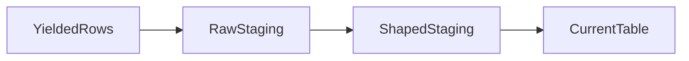

# Assquack Documentation

## Overview

Use this skill to keep Assquack documentation simple, architecture-focused, and
consistent. Assquack is a standalone DuckDB-native data asset library; do not
describe Prefect, Kubernetes, or any orchestrator as a core dependency.

Before substantial documentation work, read:

- `.agents/references/preferences.md`
- `.agents/references/code-style.md` when the docs describe implementation or
  testing behavior.

## Workflow

1. Read `docs/README.md` first to identify the correct documentation zone.
2. Edit the smallest set of docs that owns the subject. Avoid duplicating the
   same explanation across zones.
3. Add or update "Related Docs" links so readers can move laterally between
   connected topics.
4. Update `docs/README.md` whenever adding, renaming, or removing a document.
5. Keep `README.md` short; it should point to the documentation index, not
   duplicate architecture.
6. Preserve `docs/assquack-mvp-plan.md` as the archived monolithic planning
   note unless the user explicitly asks to rewrite or remove the archive.
7. Run outcome-based validation before handing off.

## Documentation Zones

- `docs/overview.md`: identity, non-goals, philosophy, high-level MVP stance.
- `docs/developer-api.md`: public Python API contract.
- `docs/developer-examples.md`: concise examples only.
- `docs/materialization-lifecycle.md`: asset execution flow and table swaps.
- `docs/schema-inference.md`: `VARIANT`, continuous inference, drift handling.
- `docs/storage-model.md`: DuckDB file, locks, tables, staging, future storage.
- `docs/exports.md`: export aliases, formats, ADLS/ABFSS compatibility.
- `docs/configuration.md`: Pydantic config, env vars, DuckDB settings.
- `docs/mad-prefect-reference.md`: historical reference only; no dependency.
- `docs/roadmap.md`: phases, acceptance criteria, open decisions.

## Mermaid Diagrams

Add a Mermaid diagram when it clarifies flow, ownership, state transitions, or
table relationships better than prose. Prefer diagrams for:

- materialization lifecycle flows;
- raw-to-shaped staging;
- schema observation and promotion;
- storage/table relationships;
- export target resolution;
- configuration precedence.

Do not add a diagram when the doc only changes wording or a short option list.
Keep diagrams small enough to maintain by hand.

Use fenced Mermaid blocks:

````markdown

````

Diagram rules:

- Use stable, descriptive node names.
- Prefer `flowchart LR` for pipelines and `sequenceDiagram` for interactions.
- Keep labels concise and ASCII-only.
- Pair every diagram with enough prose that the document still reads without
  rendering support.
- Avoid styling-heavy Mermaid unless it communicates architecture.

## Knowledge Graph Links

Treat the docs like a small knowledge graph. Every active architecture doc
should link to the docs a reader is likely to need next.

Use a `## Related Docs` section when a page has multiple neighbors. Prefer
links that explain the relationship:

```markdown
- [Schema Inference](schema-inference.md): how raw payload evidence becomes
  promoted typed columns.
```

Do not link every page to every other page. Link by conceptual adjacency:
developer API to examples and lifecycle, lifecycle to storage and inference,
storage to configuration and exports, roadmap to the major work tracks.

## Style Rules

- Follow `.agents/references/preferences.md` for product direction and workflow
  preferences.
- Keep Assquack standalone and framework-agnostic.
- Say "MAD.Prefect reference" or "optional adapter" when discussing migration;
  never imply a core runtime dependency.
- Avoid Kubernetes/PVC-specific language in MVP docs unless the user asks for a
  deployment adapter.
- Make DuckDB the source of truth; exports are compatibility artifacts.
- Prefer concrete table names, method names, and file paths over vague prose.
- Keep examples short and move extended examples to `docs/developer-examples.md`.
- Use `VARIANT` for durable dynamic payloads and explain `JSON` as ingestion or
  inference tooling where relevant.

## Validation

Before final response, run the checks that fit the change:

```bash
rg -n "Kubernetes|kubernetes|PVC|pvc|database_scope|quackasset|QuackAsset" README.md docs --glob '!docs/assquack-mvp-plan.md'
python .agents/skills/assquack-documentation/scripts/check_doc_links.py
git diff --check
```

Expected outcomes:

- The terminology scan should return no matches for active docs. Hits in
  `docs/assquack-mvp-plan.md` are intentionally excluded as archive context.
- The link check must report that all local Markdown targets exist.
- `git diff --check` must exit cleanly.

Report that the work is docs-only unless code or tests changed.
