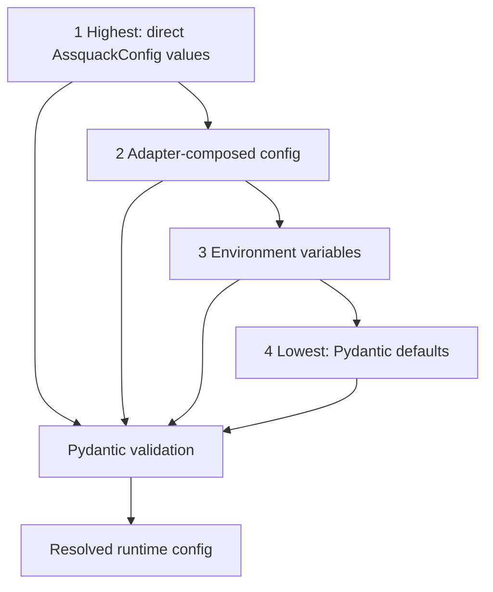

# Configuration

Assquack configuration is owned by a Pydantic model. Environment variables,
Hydra YAML, tests, and embedding runtimes are inputs to that model; they are not
separate sources of configuration truth.

The goal is for the same `AssquackConfig` contract to work in local scripts,
CI, notebooks, services, and orchestrated jobs without making Assquack depend on
any runtime framework.

## Canonical Model

`AssquackConfig` should be the only authoritative place for defaults, field
names, type coercion, and validation. Callers may construct it directly, load it
from environment variables, or ask an optional adapter to translate another
configuration system into the Pydantic shape.

Recommended top-level shape:

```text
AssquackConfig
  home
  environment
  database_path
  duckdb
    threads
    memory_limit
    temp_directory
    extensions
  exports
    enabled
    base_uri
    default_format
    snapshot_runs
    options
```

Configuration precedence should be explicit and predictable:



1. Values passed directly to `AssquackConfig`.
2. Values loaded by an adapter and then validated by `AssquackConfig`.
3. Environment variables consumed by the Pydantic settings model.
4. Pydantic defaults.

Hydra composition can decide which YAML files to load, but the result must still
be validated by Pydantic before Assquack uses it.

## Core Paths

`ASSQUACK_HOME` is the base local directory for Assquack runtime state. Its
default is:

```text
/data/assquack
```

`ENVIRONMENT` names the runtime environment and is part of the default storage
layout. Its default is:

```text
dev
```

The default database path is derived from those values:

```text
${ASSQUACK_HOME:-/data/assquack}/${ENVIRONMENT:-dev}/assquack.duckdb
```

For example, with no environment overrides:

```text
/data/assquack/dev/assquack.duckdb
```

`database_path` is configuration-level state. It is not an asset decorator
argument, and asset authors should not choose database placement for the common
case. Multiple database files can be introduced later through configuration, but
the MVP should keep one resolved database path per configured Assquack runtime.

## Local Storage Defaults

The local profile should be usable without cloud credentials or external
services. Recommended defaults:

```yaml
assquack:
  home: ${oc.env:ASSQUACK_HOME,/data/assquack}
  environment: ${oc.env:ENVIRONMENT,dev}
  database_path: ${assquack.home}/${assquack.environment}/assquack.duckdb
  duckdb:
    threads: 4
    memory_limit: 8GB
    temp_directory: ${oc.env:DUCKDB_TEMP_DIRECTORY,/data/assquack/tmp}
    extensions:
      - json
      - parquet
  exports:
    enabled: false
    base_uri: ${assquack.home}/${assquack.environment}/exports
    default_format: parquet
```

The parent directories for `database_path`, `duckdb.temp_directory`, and any
local export base must be writable by the process before materialization starts.
Assquack may create child directories when safe, but it should fail clearly when
the configured filesystem is missing or read-only.

## DuckDB Settings

DuckDB settings belong under `assquack.duckdb`.

`threads` controls DuckDB execution parallelism and maps to DuckDB's `threads`
setting when a connection is opened.

`memory_limit` controls DuckDB's memory cap and maps to DuckDB's `memory_limit`
setting. It should accept DuckDB-compatible strings such as `8GB`.

`temp_directory` controls where DuckDB writes temporary spill files. It should
default from `DUCKDB_TEMP_DIRECTORY` when present, otherwise to a local path
under `ASSQUACK_HOME`. The runtime must ensure this directory is writable and
has sufficient capacity for the largest expected materialization.

`extensions` lists DuckDB extensions Assquack should install and load during
connection setup. The local MVP profile should include `json` and `parquet`.
Profiles that read or write ADLS/ABFSS should include `azure`. Source and sink
integrations such as `postgres` are optional extensions, not core storage
requirements.

Connection setup should be deterministic:

1. Resolve and validate `AssquackConfig`.
2. Ensure local directories exist or fail with a clear error.
3. Open DuckDB at the resolved `database_path`.
4. Apply `threads`, `memory_limit`, and `temp_directory`.
5. Install and load configured extensions.
6. Bootstrap Assquack system schemas and tables.

## Exports

Exports are configured compatibility artifacts. They are not the source of truth
for an asset; the current DuckDB table and Assquack system metadata are.

Recommended export fields:

- `enabled`: whether successful materializations write compatibility artifacts;
- `base_uri`: the base for resolving `mad://...` export aliases;
- `default_format`: `parquet` by default;
- `snapshot_runs`: whether to retain run-specific export snapshots in addition
  to the current compatibility target;
- `options`: format-specific write options passed to DuckDB export statements.

Local development can use a filesystem `base_uri`, such as:

```text
${ASSQUACK_HOME}/${ENVIRONMENT}/exports
```

ADLS deployments can use an ABFSS base URI:

```text
abfss://lake/exports/assquack
```

When exports are enabled, relative decorator paths and `mad://...` aliases
resolve under `exports.base_uri`. Export paths do not choose the DuckDB database
file, schema, or table.

## ADLS Credentials

Assquack configuration should identify that ADLS/ABFSS access is needed by
loading the DuckDB `azure` extension and setting an export or source URI. It
should not store Azure secrets in checked-in YAML, decorators, or asset code.

Credentials should be supplied by the deployment environment or by DuckDB
secrets:

- Environment-based credentials are provided by the runtime before Assquack
  starts, then discovered by DuckDB's Azure extension.
- DuckDB secrets can be created outside Assquack or during controlled connection
  initialization, then referenced by DuckDB for `abfss://` reads and writes.

Assquack may validate that an ADLS profile has the `azure` extension configured,
but credential ownership remains with the runtime and DuckDB secret mechanism.

## Hydra Adapter

Hydra support is an optional adapter over the Pydantic model. It should live at
the edge of the library, for projects that already use Hydra composition.

Suggested groups:

```text
conf/assquack/default.yaml
conf/assquack/storage/local.yaml
conf/assquack/storage/adls_export.yaml
conf/assquack/duckdb/local.yaml
```

Example ADLS export profile:

```yaml
assquack:
  home: ${oc.env:ASSQUACK_HOME,/data/assquack}
  environment: ${oc.env:ENVIRONMENT,dev}
  database_path: ${assquack.home}/${assquack.environment}/assquack.duckdb
  duckdb:
    threads: 4
    memory_limit: 8GB
    temp_directory: ${oc.env:DUCKDB_TEMP_DIRECTORY,/data/assquack/tmp}
    extensions:
      - json
      - parquet
      - azure
  exports:
    enabled: true
    base_uri: abfss://lake/exports/assquack
    default_format: parquet
```

The adapter's responsibility is narrow:

1. Compose Hydra config.
2. Resolve interpolations such as `ASSQUACK_HOME` and `ENVIRONMENT`.
3. Convert the `assquack` node to plain Python data.
4. Construct and return `AssquackConfig`.

Hydra must not define behavior that Pydantic does not know about. If a field is
needed by Assquack, add it to the Pydantic model first.

## Runtime Responsibilities

The embedding runtime is responsible for the operating environment:

- provide a writable local filesystem path for `ASSQUACK_HOME`;
- provide enough disk capacity for the DuckDB database and temp spill files;
- set `ASSQUACK_HOME` when the default `/data/assquack` is not suitable;
- set `ENVIRONMENT` so dev, test, and prod do not share the same database path;
- optionally set `DUCKDB_TEMP_DIRECTORY` for larger or faster temporary storage;
- provide ADLS credentials through environment variables or DuckDB secrets;
- add external concurrency controls if the runtime needs them.

Assquack itself should enforce one writer per resolved DuckDB database path.
Embedding runtimes can run Assquack by supplying the same Pydantic
configuration inputs as any other Python runtime.

## Related Docs

- [Storage Model](storage-model.md): how `database_path` maps to DuckDB state.
- [Exports](exports.md): how export base URI and ADLS credentials are used.
- [Developer API](developer-api.md): which concerns stay out of the decorator
  and belong in configuration.
- [Overview](overview.md): the framework-agnostic design stance.
- [Roadmap](roadmap.md): configuration work in the MVP phases.
