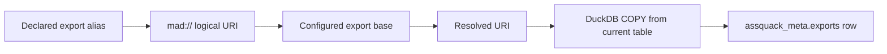

# Exports

Assquack stores asset state in DuckDB tables first. Exports are compatibility
artifacts for lake readers, legacy consumers, recovery workflows, and manual
inspection. They are not the source of truth for an asset.

This keeps the runtime model simple:



1. Materialize into staging tables inside the configured DuckDB database.
2. Transactionally publish the current asset table.
3. Record run and schema metadata in Assquack system tables.
4. Optionally export the published table to one or more file targets.
5. Record each exported artifact in the export manifest.

## Export Aliases

The public `@asset` decorator keeps the legacy path-first ergonomics. The first
positional string argument is an export alias, not the internal storage path.

```python
from assquack import asset


@asset("bronze/orders.parquet")
def orders():
    return rows
```

The example above resolves as if it had been written:

```python
@asset(export="mad://bronze/orders.parquet")
def orders():
    return rows
```

The positional path does not choose the DuckDB database file, schema, or table.
Those are derived from Assquack configuration, the asset name, the optional
`table=` override, and bound arguments. The declared path may seed the default
logical asset name when `name=` is omitted, but the resolved export destination
only describes the compatibility artifact written after a successful
materialization.

## Target Resolution

Export aliases resolve in this order:

1. A URI with an explicit scheme is used as supplied.
2. A relative path is treated as a `mad://...` URI.
3. A file type alias such as `parquet`, `json`, or `csv` derives a path from the
   asset name and configured default export base.
4. Pipe syntax expands one alias into multiple export targets.

`mad://` is Assquack's logical export scheme. It resolves to
`assquack.exports.base_uri` at runtime, preserving the legacy MAD-style path
shape without making object storage the primary database location.

Example configuration:

```yaml
assquack:
  exports:
    enabled: true
    base_uri: abfss://lake/exports/assquack
```

With that configuration:

```text
mad://bronze/orders.parquet
```

resolves to:

```text
abfss://lake/exports/assquack/bronze/orders.parquet
```

If the configured base URI is local, the same alias can resolve to a filesystem
path for development. Asset code should not need to change when moving between
local and ADLS export targets.

## File Type Aliases

The default compatibility target is Parquet. These forms are equivalent when the
asset is named `customer_summary` and the default export base is configured:

```python
@asset("parquet")
def customer_summary():
    return rows


@asset(export="parquet")
def customer_summary():
    return rows
```

Both derive a concrete Parquet target from the asset name, for example:

```text
mad://customer_summary.parquet
```

Format aliases:

| Alias | Meaning |
| --- | --- |
| `parquet` | Export the current table as Parquet. This is the default compatibility format. |
| `json` | Export JSON for legacy consumers that still require row-oriented JSON artifacts. |
| `csv` | Export CSV for simple legacy tools and manual exchange. |

A path with a known extension also selects the export format:

```python
@asset("bronze/orders.parquet")
def orders():
    return rows
```

When the path has no extension, Assquack should append the default format unless
an explicit format alias is supplied.

## Pipe Syntax

Pipe syntax lets an asset request multiple compatibility artifacts while keeping
the primary declaration compact.

```python
@asset("bronze/orders.parquet|json")
def orders_with_legacy_json_export():
    return rows
```

This expands to:

```text
mad://bronze/orders.parquet
mad://bronze/orders.json
```

The first target is the default compatibility target. Additional pipe entries
are secondary legacy exports. For example:

```python
@asset("bronze/orders.parquet|json|csv")
def orders_with_legacy_exports():
    return rows
```

expands to Parquet, JSON, and CSV exports using the same base path stem.

Pipe entries may also be used with a type-only alias:

```python
@asset("parquet|json")
def customer_summary():
    return rows
```

This derives both paths from the asset name:

```text
mad://customer_summary.parquet
mad://customer_summary.json
```

Assquack should reject ambiguous combinations, such as multiple base paths in
one string, rather than guessing.

## ADLS And ABFSS Exports

Assquack should write ADLS/ABFSS exports through DuckDB whenever possible. The
DuckDB Azure extension supports Azure Blob and ADLSv2 paths, including
`abfss://...`, and lets `COPY` write directly from the published DuckDB table to
the lake target.

The export lifecycle for an ABFSS Parquet target is:

```sql
INSTALL azure;
LOAD azure;

COPY (
  SELECT * FROM bronze.orders_current
) TO 'abfss://lake/exports/assquack/bronze/orders.parquet'
  (FORMAT parquet);
```

Credentials should be supplied through the deployment environment and DuckDB
secrets. Assquack configuration should enable the extension and identify the
export base URI, but asset authors should not embed storage credentials in
decorators.

Use an fsspec fallback only when the DuckDB Azure extension cannot satisfy a
deployment target. The normal path should be DuckDB table to DuckDB `COPY` to
the resolved export URI.

## Format Policy

Parquet is the default compatibility target because it preserves typed columns,
is compact, is efficient for lake scans, and is already the expected bridge for
existing file-backed consumers.

JSON and CSV exports are optional legacy outputs:

- JSON is useful when existing downstream code expects the old row-oriented
  artifact shape.
- CSV is useful for simple tools, audits, and manual transfer.
- Neither JSON nor CSV should drive Assquack schema inference or cache state.

Dynamic payloads should be stored in DuckDB as `VARIANT` when appropriate, then
exported to Parquet according to DuckDB's Parquet support. JSON text retention
through `_qa_raw_json` remains an explicit audit choice, not the default export
or storage model.

## Export Manifest

Every successful export should be recorded in `assquack_meta.exports`. The manifest
answers "what files were written for this run?" without making those files the
authoritative state of the asset.

The developer-facing storage model describes the manifest purpose in
[Storage Model](storage-model.md#system-tables). The concrete MVP DDL belongs
to the implementor-facing
[Local DuckDB Core epic](epics/01-mvp/01-local-duckdb-core.md#metadata-table-contracts).

`uri` stores the logical target, such as `mad://bronze/orders.parquet`.
`resolved_uri` stores the concrete target used by DuckDB, such as
`abfss://lake/exports/assquack/bronze/orders.parquet`. `role` should distinguish
the default compatibility export from secondary legacy exports.

The export manifest is append-oriented per run. A later successful run may write
the same logical target and add a new manifest row. Consumers that need the
latest export should resolve it through the latest successful Assquack run, not
by listing the object storage prefix and guessing.

## Storage Boundary

Exports are not the primary storage source of truth for these reasons:

- DuckDB tables hold the published current asset state and are queried directly
  by `.query()` and `cache_first()`.
- Assquack system tables hold run status, schema observations, cache metadata,
  and export metadata transactionally with materialization.
- Replaying exported JSON, CSV, or Parquet would reintroduce the file-fragment
  first architecture that Assquack is replacing.
- File exports can be deleted, compacted, overwritten, delayed, or disabled
  without invalidating the current DuckDB table.
- Export schemas are compatibility contracts for consumers, while internal
  tables can retain richer metadata columns and semi-structured `VARIANT`
  payloads.

The durable recovery target is the DuckDB database and Assquack metadata. Parquet
exports are a compatibility and interoperability surface, not the mechanism that
defines whether an asset exists or whether its cache is valid.

## Related Docs

- [Developer API](developer-api.md): the `@asset(...)` arguments that define
  export aliases.
- [Developer Examples](developer-examples.md): short examples of path and file
  type aliases.
- [Storage Model](storage-model.md): why DuckDB tables remain the source of
  truth.
- [Configuration](configuration.md): default export bases and ADLS credentials.
- [Materialization Lifecycle](materialization-lifecycle.md): when exports are
  written during an asset run.
