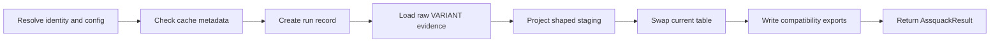

# Materialization Lifecycle

Assquack materialization is table-first. Running an asset loads observed data
into DuckDB staging tables, promotes a shaped result into the asset's current
table, records metadata inside DuckDB, and only then writes optional
compatibility exports such as Parquet.

Schema discovery is part of the run, but this document only names the lifecycle
touchpoints. Detailed inference and type resolution policy belongs in
[schema-inference.md](schema-inference.md).

## Lifecycle At A Glance



1. Bind arguments and resolve the asset identity, table, and export target.
2. Check cache metadata before calling the user function.
3. Create a run record and run-scoped staging tables.
4. Execute the asset function and normalize returned or yielded batches.
5. Load each batch into raw evidence staging.
6. Observe schema evidence and project rows into shaped staging.
7. Commit the current table swap and successful metadata update in one short
   transaction.
8. Export the committed current table if configured.
9. Return an `AssquackResult` pointing at the current DuckDB table.

The current table is the durable source of truth. Exports are compatibility
outputs for lake consumers and legacy file-backed flows.

## Argument And Path Resolution

Resolution happens before cache lookup or source IO:

- Bind call arguments with the decorated function signature, including values
  provided through `.with_arguments()`.
- Render templated asset names, table overrides, export aliases, and path
  fragments from those bound arguments.
- Resolve the positional decorator string as an export alias. By convention a
  legacy-looking path maps to a `mad://...` export target unless an explicit
  export URI or file type alias is provided.
- Resolve database placement from `AssquackConfig`, not from the asset
  decorator. The MVP writes to the configured local `.duckdb` file.
- Compute the stable `asset_id` from the explicit `name=` when supplied,
  otherwise from the declared asset path or function name plus bound arguments.
  Resolved export destinations, credentials, and export base URIs must not
  participate in identity.
- Derive sanitized DuckDB schema and table names from the resolved asset
  identity, unless `table=` provides an explicit stable name.

Path resolution does not decide where the primary data lives. The primary data
lives in DuckDB; resolved paths describe optional exports and source metadata.
File suffixes and export aliases may seed default names and formats, but they
are not mutable storage placement.

## Cache Check

`cache_first()` is evaluated after resolution and before the asset function is
called.

The cache check should read Assquack metadata, not filesystem fragments:

- Find the latest successful run for the resolved `asset_id`.
- Verify the resolved current table exists in DuckDB.
- Check TTL or freshness rules against `materialized_at`.
- If the caller requires an export artifact, verify a matching export row exists
  and, where practical, that the URI is readable.

On a cache hit, Assquack returns an `AssquackResult` for the current table and
does not create a new run record or call the user function. On a cache miss, the
normal materialization path starts.

## Run Record

Each non-cached materialization creates a row in `assquack.runs` before loading
data:

- `run_id`: unique identifier for this attempt.
- `asset_id`: resolved asset identity.
- `status`: starts as `running`.
- `runtime`: when the run started.
- `materialized_at`: set only after the current table commit succeeds.
- `duration_ms`, `row_count`, and `error`: filled at completion or failure.

`assquack.assets` is also bootstrapped or updated for the resolved asset if it
does not already exist. A failed run remains visible for diagnosis but must not
advance the asset's latest successful state.

## Batch And Yield Normalization

The materializer treats the function output as observed data, not a declared
contract.

The function may:

- return one supported object;
- return an iterable of rows;
- yield sync or async batches;
- yield pages from an API client.

Supported batch inputs include Python mappings and lists, pandas DataFrames,
Arrow tables or record batches, DuckDB relations, and HTTP responses. Each
input is normalized into a row set with a stable per-run ordering:

- `_qa_batch_id`: monotonically increasing batch number.
- `_qa_row_number`: row number within the normalized run.
- `_qa_loaded_at`: ingestion timestamp.
- optional source metadata such as `_qa_source_uri` and `_qa_source_hash`.

Normalization should avoid materializing the whole asset in Python memory.
Large inputs are processed as chunks, and each chunk is discarded after it has
been staged and observed.

## Raw Evidence Staging

Raw evidence staging captures exactly what the current run observed, without
making a durable full-size raw JSON dump the default.

The staging table is run-scoped, for example:

```sql
CREATE TABLE assquack_stage.raw_<asset_id>_<run_id> (
  _qa_run_id VARCHAR NOT NULL,
  _qa_batch_id INTEGER NOT NULL,
  _qa_row_number BIGINT NOT NULL,
  _qa_loaded_at TIMESTAMPTZ NOT NULL,
  _qa_source_uri VARCHAR,
  _qa_source_hash VARCHAR,
  _qa_payload VARIANT NOT NULL
);
```

For Python mapping/list rows, the materializer may serialize the current chunk
to transient JSON so DuckDB can cast it into `VARIANT`, but that transient text
is discarded after insertion. For typed inputs such as Arrow or DataFrames, the
materializer can insert typed columns directly while still preserving
`_qa_payload` as the durable evidence surface for raw and bronze assets with
unknown or volatile nested data.

Raw staging is not the final user table. It exists to feed schema observation,
typed projection, auditing during the run, and failure diagnostics.

## Shaped Staging

Shaped staging is the candidate result table for the run. It contains:

- reserved Assquack metadata columns such as `_qa_run_id` and `_qa_loaded_at`;
- promoted typed columns extracted from observed payload paths;
- optional `_qa_payload VARIANT` for raw or bronze assets;
- optional `_qa_raw_json` only when the asset explicitly asks for lossless text
  retention.

Each chunk is projected from raw staging into shaped staging using the effective
schema for the asset. Missing fields become `NULL`. Casts should use
conservative `try_cast`-style expressions so a single bad value can be recorded
as evidence without crashing the whole run unless the asset opts into strict
validation.

Newly observed columns may be added to shaped staging during the run. Existing
promoted columns are not dropped just because the source omitted them in a
batch. The rules for path observation, type widening, nested structures, sparse
objects, and schema promotion are covered in
[schema-inference.md](schema-inference.md).

## Transaction Boundary

The source call and chunk loading should not hold the final commit transaction
open. External API calls, Python iteration, and large staging writes can take a
long time, while the current table must remain stable for readers.

Use two boundaries:

- **Materialization attempt boundary**: acquire the Assquack writer lock for the
  configured database path, create the `running` run record, load raw staging,
  build shaped staging, and record schema observations. The current table is not
  changed during this phase.
- **Commit transaction boundary**: once shaped staging is complete and validated,
  open a short DuckDB transaction that swaps the current table and updates
  metadata declaring the run successful.

If anything fails before or during the commit transaction, the previous current
table remains the latest successful version. The run is marked failed, the error
is recorded, and run-scoped staging is cleaned up on a best-effort basis.

## Replace Mode MVP

`replace` is the only MVP materialization mode. It is a full refresh:

1. Build raw evidence staging for the run.
2. Build shaped staging for the run.
3. Validate that shaped staging has the expected reserved columns and effective
   schema.
4. In the commit transaction, replace the stable current table with the shaped
   staging contents.
5. Update metadata so cache and query calls point at the new successful run.

An empty result is still a valid replacement if the asset's effective schema can
be represented. The current table should exist after the run, even with zero
rows, so `.exists()` and `.query()` are table-based rather than file-based.

## Result Table Swap

The swap should be implemented as transactional DuckDB DDL/DML. One acceptable
shape is:

1. Create a run-scoped next table in the target schema from shaped staging.
2. Inside the same transaction, drop or rename the previous current table.
3. Rename the next table to the stable current table name.
4. Drop obsolete run-scoped staging tables after the swap succeeds.

Readers should either see the previous committed current table or the new
committed current table. They should not observe a half-loaded table as the
asset result.

## Metadata Update

The successful commit updates metadata together with the table swap:

- `assquack.assets`: asset name, signature, schema/table name, mode, and
  `updated_at`.
- `assquack.runs`: `status = 'success'`, `materialized_at`, `duration_ms`,
  `row_count`, and cleared `error`.
- `assquack.schemas`: compact schema evidence for the run.
- `assquack.schema_observations`: path/type/count evidence collected while
  loading chunks.

The latest successful run is derived from these tables. Cache checks should not
depend on exported Parquet or raw fragment files to decide whether the table is
fresh.

## Export Phase

Export happens after the current table commit. It reads from the committed
DuckDB table and writes configured compatibility artifacts, commonly Parquet to
local storage or ADLS.

The export phase should:

- use DuckDB `COPY` or native extension support where possible;
- write current-state exports from the stable current table;
- optionally write run-scoped snapshots for recovery or legacy consumers;
- insert a row into `assquack.exports` after a successful write.

An export failure must not silently roll back a successful table
materialization. If an asset or caller requires export success, the public call
may raise after recording the export error, but the committed DuckDB table
remains the latest valid result.

## Later Modes

Append, merge, and snapshot should reuse the same front half of the lifecycle:
argument resolution, cache check, run record, yield normalization, raw evidence
staging, shaped staging, and schema observation. They differ at the commit
strategy.

`append` will insert shaped staging rows into the current table instead of
replacing it. Rows keep `_qa_run_id` and `_qa_loaded_at`, and a current view may
hide superseded rows if the asset defines that behavior later.

`merge` will require key columns and commit through DuckDB `MERGE INTO`, using
shaped staging as the source of upserts. Merge policy must define duplicate key
handling, delete semantics, and how schema changes interact with existing
current rows.

`snapshot` will retain historical versions, either as per-run tables or as a
versioned history table with current/latest views. Snapshot export can write
both the current state and run-specific artifacts.

These modes should not be added until `replace` is reliable. A partial
incremental model would make cache behavior, metadata, and recovery harder to
reason about than explicit full refreshes.

## Related Docs

- [Developer API](developer-api.md): the asset calls that start this lifecycle.
- [Schema Inference](schema-inference.md): the deep inference rules used during
  raw and shaped staging.
- [Storage Model](storage-model.md): the system, asset, and staging tables used
  by the lifecycle.
- [Exports](exports.md): the compatibility export phase after materialization.
- [Roadmap](roadmap.md): when follow-up materialization modes are expected.
