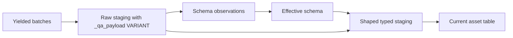

# Schema Inference

Assquack treats source schema as evidence, not as a contract. API schemas,
OpenAPI documents, generated clients, and hand-written examples are useful
hints, but they cannot be trusted as the durable table definition because they
drift from production data. Optional fields appear only for some tenants,
pagination can expose different shapes, enum-like values widen, and nested
objects frequently change without a versioned API contract.

The durable contract for an Assquack asset is therefore inferred continuously
from yielded data. Each materialization observes the rows it actually receives,
records the evidence in DuckDB metadata tables, and resolves a conservative
effective schema from current and historical observations.

## Goals

- Avoid persisting full raw JSON dumps only to let DuckDB infer schema later.
- Keep raw staging evidence in `_qa_payload VARIANT`.
- Promote stable fields into typed columns without losing access to new, sparse,
  or inconsistent fields.
- Control whether shaped/current tables retain `_qa_payload` with explicit
  policy rather than making it universally mandatory.
- Preserve historical schema evidence across runs.
- Never drop an existing promoted column just because the latest API response
  omitted it.

## Staging Flow

Every run uses two staging surfaces.

Raw evidence staging receives normalized rows from yielded batches and always
stores the full observed payload as `_qa_payload VARIANT`.

Shaped staging projects the effective schema into typed columns. It may retain
`_qa_payload` for unpromoted data when the asset's retention policy calls for
that; otherwise `_qa_payload` is available through raw staging during the run
and bounded diagnostic retention. The concrete staging DDL belongs to the
implementor-facing
[Replace Materialization epic](epics/01-mvp/02-replace-materialization.md#staging-table-contracts).

The materializer should process batches in chunks:

1. Normalize each yield into rows. Supported inputs can include mappings/lists,
   async iterables, pandas DataFrames, Arrow tables or batches, DuckDB
   relations, and HTTP responses.
2. Insert the chunk into raw staging with `_qa_payload VARIANT`.
3. Use transient JSON tooling only for the current chunk when the source arrives
   as JSON or Python mappings. Do not persist a full raw JSON dump by default.
4. Append compact structure and path-level evidence to the metadata tables.
5. Resolve the effective schema using all prior observations plus the current
   run's new observations.
6. Add any newly promoted columns to shaped staging and project values with
   generated extraction plus `try_cast` expressions. Missing fields become
   `NULL`.
7. Replace the current asset table in the MVP. Existing promoted columns remain
   unless an asset author explicitly removes them. Append and merge behavior
   are later materialization modes.

## Metadata Tables

Schema evidence belongs in Assquack system tables, not in external fragment
files.

`assquack.schemas` stores run-level structure artifacts, such as a compact
merged JSON structure and the resolved schema used for projection.
`assquack.schema_observations` stores path-level counts and observed types so
later runs can distinguish missing fields from removed fields, sparse fields
from stable fields, and occasional bad values from real type changes.

The concrete metadata DDL belongs to the implementor-facing
[Local DuckDB Core epic](epics/01-mvp/01-local-duckdb-core.md#metadata-table-contracts).

## DuckDB JSON Tooling

DuckDB JSON functions should be used as transient inference and transformation
tools. They are not the default durable storage layer for dynamic source data.
DuckDB `JSON` is useful for parsing, inspecting, and transforming; `_qa_payload
VARIANT` is the default durable representation for raw or bronze
semi-structured payloads. Treat `JSON` as text-backed tooling, not as a
JSONB-like storage primitive.

For JSON-origin chunks:

- Use `json_group_structure` to produce a compact merged shape for the chunk or
  run.
- Use `json_tree` to collect path-level evidence, including nested values and
  repeated array paths.
- Use `json_transform` when applying a known structure to convert JSON into
  nested DuckDB values for projection or validation.
- Use `read_json` only for source files or transient chunk files when needed.
  In inference jobs where full scanning is acceptable, prefer deep options such
  as `maximum_depth = -1`, `sample_size = -1`, and `union_by_name = true`.

The transient chunk can be an in-memory relation, a temporary table, or a small
temporary file passed through `read_json`. It should be discarded after
insertion, observation, and projection. For arrays, store enough path detail to
inspect indexed elements, but normalize paths when resolving promoted columns
so `items[0].id` and `items[1].id` contribute to the same element-shape
decision.

Example SQL for structure capture and path observation belongs to the
implementor-facing
[Replace Materialization epic](epics/01-mvp/02-replace-materialization.md#schema-observation-queries).

## VARIANT Payloads

Raw staging always includes `_qa_payload VARIANT NOT NULL`. That payload gives
Assquack a loss-tolerant landing zone for source data while typed promoted
columns evolve. Query and projection code can inspect raw staging payloads with
DuckDB `VARIANT` operators and functions, including dot access,
`variant_extract`, and `variant_typeof`.

Retention beyond raw staging is policy-controlled. Raw or bronze current tables
with unknown or volatile nested data may keep `_qa_payload VARIANT`; shaped
tables that are already fully promoted may omit it. The MVP should not imply
that every shaped/current table has `_qa_payload`, or that retained shaped
payloads are always `NOT NULL`.

Use typed columns for fields that have proven stable and useful for SQL. Keep
fields in `_qa_payload` when they are new, sparse, deeply nested, high-cardinality
objects, or type-inconsistent. `_qa_raw_json` can still be offered as an
explicit audit option, but it should not be the normal durable representation.

## Type Resolution

Schema resolution must be conservative. A bad promotion is worse than leaving a
field in `_qa_payload`.

Rules:

- `NULL` never defines a column type by itself.
- Missing fields do not imply deletion. They update presence counts and may
  affect confidence, but they do not remove existing columns.
- Numeric types widen instead of conflicting. For example, integer evidence can
  widen to decimal or double when later values require it.
- Date and timestamp detection must track successful parses and failed parse
  counts. A field should not become temporal if parse failures are material.
- Boolean, numeric, string, temporal, object, and list evidence should be
  recorded separately before resolving a single promoted type.
- A scalar/object/list conflict remains `VARIANT` unless the asset author
  provides an override.
- Existing promoted columns are never auto-dropped. Removal requires an
  explicit migration or asset configuration change.

Suggested resolution order:

1. Ignore pure-null evidence.
2. Merge compatible scalar types with widening.
3. Promote stable objects to `STRUCT` only when keys and value types are
   sufficiently consistent.
4. Promote stable arrays to `LIST(...)` only when element shape is sufficiently
   consistent.
5. Use `MAP` for sparse objects with many dynamic keys.
6. Keep genuinely variant or conflicting shapes as `VARIANT`.

## Sparse And Nested Data

Sparse fields are expected in API data. Assquack should track them without
forcing unstable table churn.

- A field observed in a small fraction of rows can stay in `_qa_payload` until
  it is useful enough to promote.
- A field missing from the current batch but observed previously remains part of
  the resolved schema if already promoted.
- Stable nested objects can become `STRUCT`.
- Objects with many tenant-specific or ID-like keys should become `MAP` or stay
  `VARIANT`.
- Arrays with a stable element type can become `LIST(<type>)`.
- Arrays with mixed scalar/object/list elements stay `VARIANT`.
- Empty arrays do not define an element type by themselves.

This policy keeps narrow, query-friendly columns for common fields while making
the source payload available for discovery and backfill.

## Promotion

Promotion is the act of turning an observed path into a typed column in the
asset table. It can be automatic for low-risk fields or explicit when the field
is business-critical.

A promoted column records:

- source path,
- resolved DuckDB type,
- first observed run,
- last observed run,
- parse or cast failure count,
- whether promotion was automatic or explicit.

Projection should use generated expressions that tolerate missing and malformed
values. Failed casts should be counted as observations. They are schema
evidence, not silent data loss.

Example projection SQL belongs to the implementor-facing
[Replace Materialization epic](epics/01-mvp/02-replace-materialization.md#projection-contract).

## Operational Contract

The schema inference loop is part of materialization:

- Inference runs on every materialization, not only the first run.
- Evidence is accumulated across runs in `assquack.schemas` and
  `assquack.schema_observations`.
- Raw staging evidence is `_qa_payload VARIANT`, not full raw JSON files.
- Raw staging retention is bounded to the latest successful run and the latest
  three failed runs per asset.
- Shaped/current `_qa_payload` retention is an asset policy decision, not a
  universal table contract.
- JSON functions and `read_json` are transient tools for chunks, source files,
  and transformation.
- Promotion is additive by default.
- Existing promoted columns never auto-drop.
- Asset authors can override resolution when they know a source contract better
  than the observed data.

This gives Assquack DuckDB-native schema evolution without making raw JSON
fragments the center of the storage model.

## Related Docs

- [Materialization Lifecycle](materialization-lifecycle.md): where raw evidence
  and shaped staging are created.
- [Storage Model](storage-model.md): the metadata tables that store schema
  observations.
- [Exports](exports.md): how `VARIANT` payloads interact with Parquet exports.
- [Developer API](developer-api.md): accepted inputs that feed continuous
  inference.
- [Roadmap](roadmap.md): when semi-structured evidence work enters the MVP.
