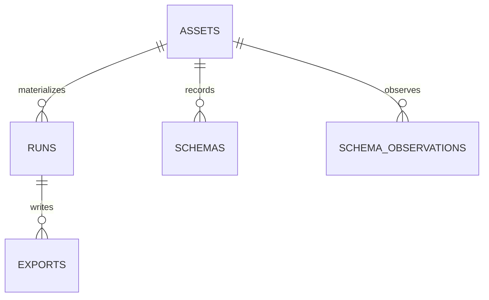

# Assquack Storage Model

Date: 2026-05-08

## Position

Assquack uses embedded DuckDB as its primary storage engine. The MVP write
target is a native `.duckdb` database file on a local writable filesystem path.
This keeps materialization close to DuckDB's intended embedded model and avoids
persisting large raw JSON or intermediate file fragments just so DuckDB can
infer, replay, and query data later.

The primary database file is not an object-storage artifact. Do not use ABFSS,
ADLS, or another remote object-store path as the mutable primary location for a
`.duckdb` file. Object storage remains part of the storage architecture for
source reads, Parquet exports, run snapshots, recovery backups, and compatibility
with existing lake conventions.

## Database Path

The zero-configuration database path is relative to the process's current
working directory:

```text
<current-working-directory>/{environment}/assquack.duckdb
```

`ASSQUACK_HOME` or direct `AssquackConfig` values override that default for
deployments and exceptional runtimes.

Asset authors should not choose database placement in the asset decorator for
the common case. Runtime and project configuration own placement through
`AssquackConfig`, environment variables, or a Hydra adapter.

Example configuration:

```yaml
assquack:
  home: ${oc.env:ASSQUACK_HOME,.}
  environment: ${oc.env:ENVIRONMENT,dev}
  database_path: ${assquack.home}/${assquack.environment}/assquack.duckdb
  duckdb:
    temp_directory: ${oc.env:DUCKDB_TEMP_DIRECTORY,${assquack.home}/tmp}
    extensions:
      - json
      - parquet
      - azure
      - postgres
  exports:
    enabled: true
    base_uri: abfss://lake/exports/assquack
```

The current-working-directory default requires no runtime configuration.
Deployments must provide writable paths for any configured database home and
DuckDB temp directory. Database placement is not part of the asset identity API.

## Concurrency

A DuckDB database file has one writer at a time. Assquack must enforce this rule
with an Assquack lock keyed by the resolved database path before opening a
write-capable connection or starting materialization.

The lock is an application-level guard around the database file, not a
replacement for DuckDB's own transaction rules. Its responsibilities are:

- serialize write-capable Assquack materializations for the same database path;
- fail or wait predictably when another writer owns the path;
- keep lock ownership independent of asset name, because two assets can share
  one database file;
- allow external orchestrators to add their own concurrency controls without
  becoming core Assquack dependencies.

Multiple readers are acceptable when the database is opened read-only or after a
materialization transaction has completed.

## Internal Schemas

Assquack reserves the `assquack_meta` schema for system metadata. The distinct
name avoids colliding with the `assquack` catalog that DuckDB derives from the
default `assquack.duckdb` filename. Assquack also reserves a staging schema for
run-local working tables, recommended as `assquack_stage`. User asset tables
should live in sanitized asset schemas and tables chosen from asset metadata and
bound arguments.

Reserved schema purposes:

```text
assquack_meta   system metadata tables
assquack_stage  raw and shaped staging tables for active or recent runs
<asset_schema>  durable user-facing asset tables and views
```

## System Tables

The MVP metadata catalog is stored inside the same DuckDB database file as the
asset tables. Bootstrap must create the `assquack` schema and the following
tables.



`assquack_meta.assets` is the asset manifest. `assquack_meta.runs` records
materialization attempts and their final status. `assquack_meta.schemas` stores
run-level schema evidence such as JSON structure summaries.
`assquack_meta.schema_observations` stores path-level evidence across runs.
`assquack_meta.exports` records external
artifacts such as current-state Parquet or run snapshots. `uri` is the logical
target, such as `mad://bronze/orders.parquet`; `resolved_uri` is the concrete
target used by DuckDB; `role` distinguishes the default compatibility export
from secondary legacy exports.

Developer-facing docs describe the purpose of these tables. The concrete MVP
DDL belongs to the implementor-facing
[Local DuckDB Core epic](epics/01-mvp/01-local-duckdb-core.md#metadata-table-contracts).

## Asset Tables

Each asset gets a stable `asset_id` derived from explicit `name=` when supplied,
otherwise from the declared asset path or function name plus bound arguments.
Resolved export destinations, credentials, export base URIs, and database paths
must not change the canonical identity. Assquack uses that identity to
derive or validate:

- the metadata row in `assquack_meta.assets`;
- a sanitized schema name;
- a sanitized table name;
- the current durable asset table;
- staging table names for each run;
- export records and cache state.

The current table is the user-facing table queried by `AssquackResult.query()`
and exported to Parquet when exports are enabled. For MVP `replace` mode,
materialization builds staging tables first, then swaps or replaces the current
table inside a DuckDB transaction.

Near-term modes can reuse the same table model:

- `append` adds rows with run metadata and may expose a current view;
- `merge` requires key columns and upserts into the current table;
- `snapshot` retains historical rows or per-run tables and exposes current or
  latest views.

## Staging Tables

Every materialization run should use staging tables in `assquack_stage`. Staging
is the working area where yielded source data becomes durable DuckDB rows,
schema evidence, and typed projections before promotion to the current table.

Recommended raw staging shape includes run and batch identifiers, row ordering,
load timestamps, optional source URI/hash provenance, and `_qa_payload VARIANT`
for the observed source payload.

Recommended shaped staging shape:

```text
assquack_stage.shaped_<asset_id>_<run_id>
```

Shaped staging projects stable or promoted fields into typed columns. It may
retain `_qa_payload` when policy requires raw, bronze, audit, or discovery
access, but raw staging is the mandatory evidence surface. During a run,
Assquack may add newly discovered shaped columns. It should not drop columns
just because an API omitted fields in the current batch.

The exact staging DDL belongs to the implementor-facing
[Replace Materialization epic](epics/01-mvp/02-replace-materialization.md#staging-table-contracts).

Raw staging is the evidence surface. Shaped staging is the promotion surface.
The current asset table is updated only after staging and metadata writes are
ready to commit.

Staging retention is intentionally bounded. Keep the latest successful raw
staging table per asset for diagnostics, keep the latest three failed run
staging sets per asset, and prune older tables from `assquack_stage`. The
materialization lifecycle owns the retention rule; storage code should provide
the cleanup operations needed to enforce it.

## Reserved Metadata Columns

Assquack reserves `_qa_` column names for framework metadata. User asset tables
should include the relevant subset of these columns:

```text
_qa_run_id
_qa_loaded_at
_qa_source_uri
_qa_source_hash
_qa_payload
_qa_raw_json
```

Column meanings:

- `_qa_run_id`: materialization run that loaded the row;
- `_qa_loaded_at`: timestamp when Assquack loaded the row;
- `_qa_source_uri`: optional source URI or export/source reference;
- `_qa_source_hash`: optional hash for source or row provenance;
- `_qa_payload`: optional semi-structured payload, `VARIANT` by default;
- `_qa_raw_json`: optional lossless text retention for explicit audit needs.

`_qa_payload` is the default durable representation for unknown or volatile
nested payloads. DuckDB `JSON` is still useful for parsing, validation, and
schema inference, but Assquack should not persist full raw JSON dumps by default
as the normal storage path for dynamic structures.

## Exports And Object Storage

ADLS and ABFSS paths are export and integration targets, not the mutable primary
database location. Use object storage for:

- current-state Parquet exports;
- run snapshot exports;
- recovery backups of local database files;
- source data reads;
- compatibility with existing datalake conventions.

`assquack_meta.exports` records each exported artifact with its run, asset, logical
URI, resolved URI, role, format, row count, optional byte count/hash, options,
and creation timestamp. DuckDB's Azure extension should be the first choice for
`abfss://` reads and writes when available. A filesystem fallback can be added
only where DuckDB's native integration cannot satisfy the deployment target.

## Future Shared Storage

If Assquack needs shared multi-process or multi-host write semantics, the target
future architecture is DuckLake with a PostgreSQL catalog and ADLS-backed data
files. That model keeps DuckDB-compatible table access while moving shared
catalog coordination out of a single mutable `.duckdb` file.

The DuckDB Postgres extension remains useful for reading from or writing to
PostgreSQL sources and sinks. It should not be treated as storing a DuckDB
database inside PostgreSQL.

## Related Docs

- [Configuration](configuration.md): how the database path and DuckDB settings
  are resolved.
- [Developer API](developer-api.md): how declared asset names and paths seed
  identity without exposing storage placement.
- [Materialization Lifecycle](materialization-lifecycle.md): how staging tables
  are populated and swapped into current tables.
- [Schema Inference](schema-inference.md): how schema evidence is stored and
  promoted.
- [Exports](exports.md): why object storage is an output surface, not the
  mutable source of truth.
- [Roadmap](roadmap.md): future shared-storage exploration.
